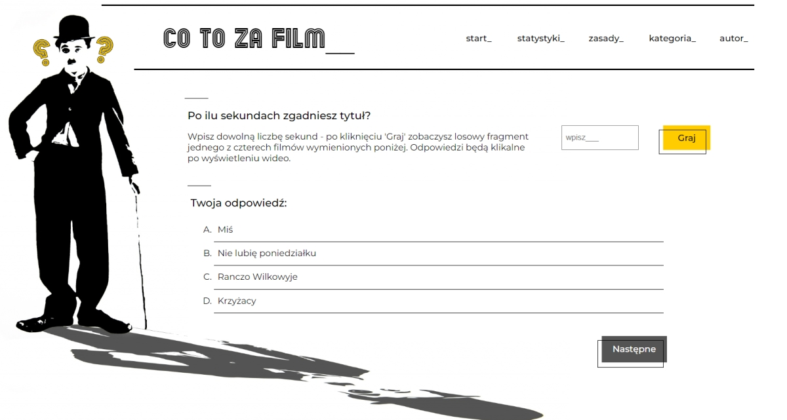

# Co to za film? - movie challenge app

This application is a movie quiz modeled after a popular music quiz show.

You can see and try this application here: [https://dariuszstawik.github.io/movie-challenge/](https://dariuszstawik.github.io/movie-challenge/)

## How does it work?

Say after how many seconds you guess the title of the movie. Can you manage after one? In the "statistics" tab you can check the number of correct and incorrect answers, as well as the average time for a good one. 

Note that it is better to run this app on desktop because Youtube Api blocks autoplay on mobile devices. 

Have fun!

## Further plans

Currently in the application's database there are approx. 30 films - older Polish productions, which are available in full on Youtube. Ultimately, the player will be able to choose from several categories (e.g. Oscars, festival films, comedies). The basis in this case will be not whole films, but trailers. Functionality and base are currently being prepared.

In the future, I also plan to create a game option for 2 and more players.

## Technology stack

In this project I used:
- React,
- Redux,
- Styled Components.

I created the layout using Inkscape.
